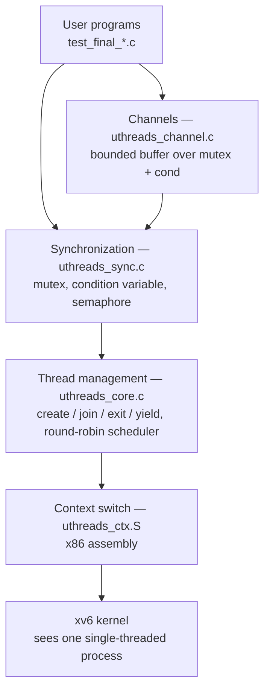

# xv6 User-Level Threading Library

A cooperative threading library built entirely in user space on top of
[xv6](https://github.com/mit-pdos/xv6-public) (the x86 teaching OS from MIT). The kernel
sees a single process; inside it, the library creates threads, switches between them in
hand-written x86 assembly, and provides mutexes, condition variables, semaphores, and
channels — none of which xv6 offers.

> **Team project.** Built with Seongjae Jung ([@seongjaeny](https://github.com/seongjaeny))
> as the final project for **CS-GY 6233 Introduction to Operating Systems** (NYU Tandon,
> Fall 2025, Prof. Kamen Yotov). We worked as a pair on a shared machine, so every commit
> on this branch carries a single author; the [design document](docs/Design_Document.pdf)
> and this README reflect the joint work of both of us.

The assignment awarded 95 points for the required parts and offered four separate optional
tiers on top. We implemented all of them, including the "extra-extra credit" channels and
the thread-safe I/O grade upgrade.

| Part | Scope | Status |
| --- | --- | --- |
| 1 | Threading foundation: create, join, exit, yield, scheduler (60 pts) | Done |
| 2 | Mutex and shared-counter race demonstration (35 pts) | Done |
| 2.5 | Channels (extra-extra credit) | Done |
| 3 | Producer-consumer and reader-writer using the primitives (extra credit) | Done |
| 4 | Thread-safe file I/O (extra credit) | Done |

---

## Contents

- [Architecture](#architecture)
- [API](#api)
- [Implementation notes](#implementation-notes)
- [Test programs](#test-programs)
- [Building and running](#building-and-running)
- [Design document](#design-document)
- [Repository notes](#repository-notes)

---

## Architecture

The library is layered, and each layer only talks to the one below it. Synchronization
primitives are built on thread states rather than on hardware atomics, which is possible
because scheduling is cooperative: a thread only loses the CPU when it explicitly yields or
blocks, so a critical section between two yield points is already atomic.



Files:

| File | Role |
| --- | --- |
| `uthreads.h` | Public API included by user programs |
| `uthreads_private.h` | Thread struct, states, and internal constants |
| `uthreads_core.c` | Thread lifecycle and the round-robin scheduler |
| `uthreads_sync.c` | Mutex, condition variable, semaphore |
| `uthreads_channel.c` | Bounded-buffer channels |
| `uthreads_ctx.S` | Context switch in x86 assembly |
| `safeio.h`, `safeio.c`, `safeio_private.h` | Thread-safe file I/O (Part 4) |

## API

```c
void  thread_init(void);
int   thread_create(void *(*start_routine)(void *), void *arg);
void  thread_exit(void *retval);
void *thread_join(int tid);
int   thread_self(void);
void  thread_yield(void);

void mutex_init(mutex_t *m);
void mutex_lock(mutex_t *m);
void mutex_unlock(mutex_t *m);

void cond_init(cond_t *c);
void cond_wait(cond_t *c, mutex_t *m);
void cond_signal(cond_t *c);
void cond_broadcast(cond_t *c);

void sem_init(sem_t *s, int value);
void sem_wait(sem_t *s);
void sem_post(sem_t *s);

channel_t *channel_create(int capacity);
int        channel_send(channel_t *ch, void *data);
int        channel_recv(channel_t *ch, void **data);
void       channel_close(channel_t *ch);
```

`mutex_t`, `cond_t`, and `sem_t` are defined in the public header so user code can declare
them as globals, statics, or locals without a heap allocation. `channel_t` stays opaque
because its buffer is sized at creation.

## Implementation notes

**Thread structure and states.** Each thread holds a saved stack pointer, a `malloc`'d
stack, a thread ID, a state, its start routine and argument, a return value, a pointer to
whoever is blocked in `thread_join` on it, and a link field for wait queues. The limits are
64 threads and an 8 KB stack each. States move UNUSED → RUNNABLE on create, RUNNABLE ⇄
RUNNING as the scheduler picks and preempts, RUNNING → SLEEPING when blocking on a
primitive, RUNNING → ZOMBIE on exit, and ZOMBIE → UNUSED once `thread_join` collects the
return value.

**Context switch.** This has to be assembly — C gives you no way to reassign the stack
pointer out from under yourself. The switch pushes the callee-saved registers (`ebx`,
`esi`, `edi`, `ebp`) onto the outgoing thread's stack, stores `esp` into its thread struct,
loads the incoming thread's `esp`, pops its registers, and returns. Because the return
address comes off the new thread's stack, `ret` lands wherever that thread last switched
out. `eax`, `ecx`, and `edx` are deliberately not saved: the cdecl calling convention already
lets a callee clobber them.

New threads need a stack that looks like one which has already been switched out, so the
initial frame is forged with a trampoline as the return address. The first switch into a new
thread "returns" into the trampoline, which calls the user's start routine and then feeds its
return value to `thread_exit`.

**Scheduler.** Round-robin over the thread table, scanning forward from the current index
for the next RUNNABLE entry. If nothing else is runnable, the current thread keeps going.

**Mutex.** Tracks locked state, owner, and a FIFO wait queue. `mutex_lock` takes a free lock
immediately; otherwise it enqueues itself, marks itself SLEEPING, and calls the scheduler.
`mutex_unlock` hands ownership directly to the head of the queue and wakes it, rather than
releasing the lock and letting waiters race for it — which avoids a wakeup where the winner
finds the lock already taken.

**Condition variables.** A wait queue with no state of its own. `cond_wait` enqueues,
releases the mutex so others can make progress, sleeps, and re-acquires the mutex on wake.
`cond_signal` wakes one waiter, `cond_broadcast` wakes all of them.

**Semaphores.** A counter plus a wait queue. `sem_wait` decrements and blocks if the value
goes negative, so the magnitude of a negative value is exactly the number of waiters.
`sem_post` increments and wakes one waiter if the previous value was negative.

**Channels.** A bounded buffer guarded by a mutex with two condition variables, `not_empty`
and `not_full`. `channel_send` blocks when full, `channel_recv` blocks when empty, and
`channel_close` broadcasts on both so that every blocked thread can observe the close and
return `-1` instead of hanging.

**Reader-writer lock.** Implemented on top of the primitives with writer priority. Readers
wait while a writer is active *or* any writer is queued, which prevents a steady stream of
readers from starving writers. Releasing a writer wakes the next writer if one is waiting,
otherwise it wakes all readers.

**Thread-safe file I/O.** xv6's `read` and `write` block the whole process, which for a
user-level threading library means one thread doing I/O freezes every other thread. The fix
is a dedicated I/O worker thread: `safe_read` and `safe_write` package the request, push it
onto a channel, and wait on a condition variable. The worker performs the real syscall,
stores the result, and signals the caller. The rest of the threads keep running while the
request is outstanding.

**On the race-condition demo.** Part 2 asks for a shared counter with and without the mutex.
Four threads each increment a counter 1,000 times, and both versions report 4,000. That is
not a broken demo — under cooperative scheduling the read-modify-write never gets
interrupted, because a switch only happens at an explicit yield. The mutex version is the
one that stays correct if preemption is ever added. The design document spells this out
rather than papering over it.

## Test programs

| Program | What it exercises |
| --- | --- |
| `t_part1` | Thread creation, yielding, scheduling, join return values |
| `t_part2` | Mutex, shared counter with and without locking, condition variables, channels |
| `t_part3_pc` | Producer-consumer over a channel |
| `t_part3_pc_sem` | Producer-consumer with two semaphores and a buffer mutex |
| `t_part3_rw` | Reader-writer lock with writer priority |
| `t_part4_safeio` | Thread-safe file I/O with a writer and reader process |

## Building and running

Requires an i386 cross-compiler and QEMU. On a non-x86 host, install
`i386-elf-gcc` and `qemu-system-i386` (both available through Homebrew on macOS).

```bash
make clean && make qemu-nox
```

At the xv6 shell prompt, run any of the test programs:

```
$ t_part1
$ t_part2
$ t_part3_pc
$ t_part3_pc_sem
$ t_part3_rw
$ t_part4_safeio
```

Exit QEMU with `Ctrl-a x`.

## Design document

[`docs/Design_Document.pdf`](docs/Design_Document.pdf) is the report submitted for the
course. It walks through every design decision above and includes annotated screenshots of
each test program's output — thread interleaving in Part 1, the mutex comparison and channel
transfer in Part 2, the item accounting for both producer-consumer variants, reader-writer
alternation, and the interleaved writer/reader trace for thread-safe I/O.

## Repository notes

This branch is the xv6-public x86 tree with the threading library added on top; the base
operating system is MIT's and is unmodified apart from a few small utilities added for
earlier coursework (`halt.c`, `nice.c`, `tail.c`, and the `test_lock*` programs). Everything
named `uthreads_*` or `safeio*`, along with the `test_final_*` programs, is our work.

xv6 itself is MIT-licensed; see [`LICENSE`](LICENSE). It derives from Sixth Edition Unix and
is maintained by MIT PDOS at
[mit-pdos/xv6-public](https://github.com/mit-pdos/xv6-public), which has since been
superseded by [xv6-riscv](https://github.com/mit-pdos/xv6-riscv).
